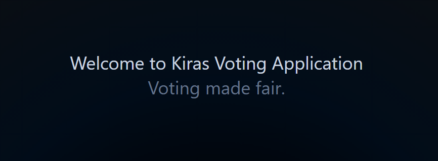

# Solana Voting Application



A decentralized voting application built on the Solana blockchain using the Anchor framework for smart contract development and a React (Next.js) frontend. This application allows users to add candidates, view candidates, and cast votes securely and transparently, making voting a fair and straight forward process.

## Live Demo

The application is deployed and live at: [Voting App on Vercel](https://voting-app-ten-tawny.vercel.app/)

## Project Description

This project demonstrates a decentralized voting system where users can:

- **Add Candidates**: Users can add new candidates by providing a name, image URL, and description.
- **View Candidates**: Display a list of all candidates along with their vote counts.
- **Cast Votes**: Users can cast a vote for a candidate (one vote per user).

The smart contract (Anchor program) handles the logic for adding candidates and voting, ensuring that all transactions are recorded on the Solana blockchain.

## Technologies Used

- **Solana Blockchain**: For decentralized and fast transactions.
- **Anchor Framework**: For writing and deploying Solana smart contracts.
- **React (Next.js)**: For building the frontend application.
- **TypeScript**: For type safety in both the frontend and smart contracts.
- **Tailwind CSS**: For styling the frontend components.

## Prerequisites

Ensure you have the following installed:

- **Rust**: `rustc 1.79.0`
- **Solana CLI**: `solana-cli 1.18.18`
- **Anchor CLI**: `anchor-cli 0.30.1`
- **Node.js**: `v20.10.0`
- **npm**: `10.2.3`
- **Yarn**: `1.22.21`

## Building and Testing the Anchor Program Locally

Follow these steps to build and test the Anchor program:

1. **Clone the Repository**
   ```bash
   git clone https://github.com/School-of-Solana/program-karimnasereddin.git
   ```

2. **Navigate to the Program Directory**
   ```bash
   cd anchor_project/voting
   ```

3. **Install Dependencies**
   ```bash
   yarn install
   ```

4. **Build the Program**
   ```bash
   anchor build
   ```

5. **Run Tests**
   ```bash
   anchor test
   ```

This will deploy the program locally and run the test suites to ensure everything works as expected.

## Building and Testing the Front-End Locally

Follow these steps to build and test the frontend:

1. **Clone the Repository** (if you haven't already)
   ```bash
   git clone https://github.com/School-of-Solana/program-karimnasereddin.git
   ```

2. **Navigate to the Frontend Directory**
   ```bash
   cd frontend/scaffold
   ```

3. **Install Dependencies**
   ```bash
   yarn install
   ```

4. **Install Additional Packages**
   ```bash
   yarn add "@coral-xyz/anchor"
   yarn add '@solana/web3.js'
   ```

5. **Build the Application**
   ```bash
   npm run build
   ```

6. **Start the Development Server**
   ```bash
   npm run dev
   ```

7. **Access the Application**
   Open your browser and navigate to http://localhost:3000/ to view the application.


## Acknowledgments

- **Solana**: For providing the high-performance blockchain platform.
- **Anchor**: For simplifying smart contract development on Solana.
- **Vercel**: For hosting the frontend application.
